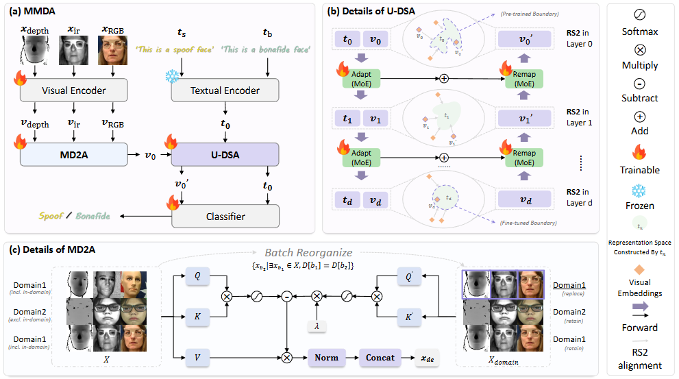
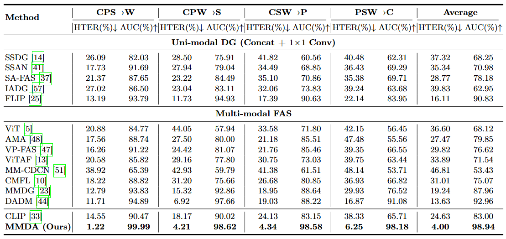

# MMDA

Official PyTorch implementation of **"Purify then Guide: Rethinking Domain Generalization for Multimodal Face Anti-Spoofing"**, accepted by **ECCV 2026**.

MMDA is a domain-generalization framework for multimodal face anti-spoofing using RGB, depth, and infrared inputs.

## Framework



## Results



## Installation

```bash
conda create -n mmda python=3.10 -y
conda activate mmda
pip install torch==2.3.0 torchvision==0.18.0 --index-url https://download.pytorch.org/whl/cu121
pip install -r requirements.txt
```

Configure the dataset paths and output directory in `config/trainer_config.py` before training.

## Training

We use three GPUs for training. Configure Accelerate with three processes, then run:

```bash
accelerate config
CUDA_VISIBLE_DEVICES=0,1,2 accelerate launch train.py
```

Full fine-tuning is used by default. To freeze the pretrained CLIP backbone, run:

```bash
CUDA_VISIBLE_DEVICES=0,1,2 accelerate launch train.py --freeze_backbone
```

## Citation

The BibTeX entry will be added after the ECCV 2026 proceedings are available.
